# Quality of Life: Recipes
Quality of Life: Recipes intends to recreate, add to, and improve the recipes introduced by Quality of Life.

## Changes
* Caving Gear uses 20 Spelunker Potions instead of 25.
* Celestial Flower has been removed in favor of the Celestial Flower Cuffs.
* Added recipe for Elemental Ninja Boots.
* Atomic Boots have been changed to Atomic Ninja Boots.

## Recipes
| Ingredient 1 | Ingredient 2 | Ingredient 3 | Result |
| ------------ | ------------ | ------------ | ------ |
|  Sweetheart Necklace |  Star Veil | |  Sweet Star Veil |
|  Frog Leg |  Lucky Horseshoe | | 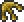 Frogshoe |
|  Fart in a Balloon |  Honey Balloon |  Sharkron Balloon |  Bunch of Balloons |
|  Bunch of Balloons |  Bundle of Balloons | | 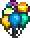 Cloud of Balloons |
|  Cloud of Balloons |  Frogshoe | | 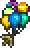 Cloud of Frogshoe Balloons |
|  Lava Charm |  Obsidian Rose | | 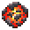 Lava Orb |
|  Charm of Myths |  Mana Regeneration Band | |  Lifeforce Bracelet |
|  Toolbox |  Toolbelt | | 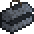 Heavy-Duty Toolbox |
|  Night Vision Helmet |  Spelunker Potion (x20) | |  Caving Gear |
|  Caving Gear |  Mining Helmet | | 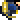 Mining Gear |
|  Goggles |  Hunter Potion (x20) |  Dangersense Potion (x20) |  Orange-Tinted Goggles |
|  Orange-Tinted Goggles |  Mining Gear | | 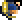 Utility Helmet |
|  Extractinator |  Alchemy Table | | 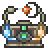 Alteration Station |
|  Mana Flower |  Celestial Cuffs | | 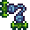 Celestial Flower Cuffs |
|  Lava Waders |  Frostspark Boots | | 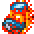 Elemental Boots |
|  Elemental Boots |  Master Ninja Gear | | 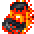 Elemental Ninja Boots |
|  Elemental Ninja Boots |  Flower Boots |  Gravity Globe | 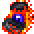 Atomic Ninja Boots |

## Credits
* [INFINITE POWER](https://forums.terraria.org/index.php?members/infinite-power.30898/) for the original QOL and sprites
* [Ardosos](https://forums.terraria.org/index.php?members/ardosos.50173/) for the code for the Alteration Station
* Re-Logic for the item sprites