# Quality of Life: Recipes
Quality of Life: Recipes intends to recreate, add to, and improve the recipes introduced by Quality of Life.

## Changes
* 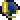 Caving Gear uses 20 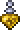 Spelunker Potions instead of 25.
* Celestial Flower has been replaced with the  Celestial Flower Cuffs.
* Added recipe for 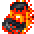 Elemental Ninja Boots.
* Atomic Boots have been changed to  Atomic Ninja Boots.
* 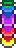 Supreme Slime Banner uses the 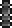 Black Slime Banner.
* 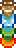 Elemental Slime Banner uses the  Lava Slime Banner.
* 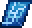 The Grand Design requires the 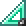 Mechanical Ruler.
* 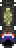 Undead Banner requires Raincoat Zombie Banner.
* Master Fishing Gear has been removed.
* Sharp Sea Necklace has been removed.

## Recipes
### Accessories
All of the items below are crafted at the 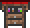 Tinkerer's Workshop.

| Ingredients  |     |     | Result |
| ------------ | --- | --- | ------ |
| 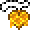 Sweetheart Necklace | 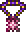 Star Veil | | 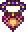 Sweet Star Veil |
| 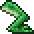 Frog Leg | 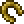 Lucky Horseshoe | | 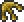 Frogshoe |
|  Fart in a Balloon | 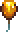 Honey Balloon | 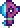 Sharkron Balloon | 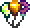 Bunch of Balloons |
|  Bunch of Balloons |  Bundle of Balloons | | 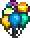 Cloud of Balloons |
|  Cloud of Balloons |  Frogshoe | | 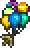 Cloud of Frogshoe Balloons |
| 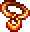 Lava Charm |  Obsidian Rose | | 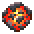 Lava Orb |
| 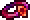 Charm of Myths | 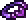 Mana Regeneration Band | | 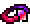 Lifeforce Bracelet |
| 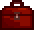 Toolbox | 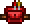 Toolbelt | | 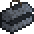 Heavy-Duty Toolbox |
| 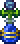 Mana Flower | 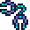 Celestial Cuffs | |  Celestial Flower Cuffs |
| 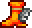 Lava Waders | 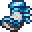 Frostspark Boots | | 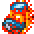 Elemental Boots |
|  Elemental Boots | 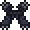 Master Ninja Gear | |  Elemental Ninja Boots |
|  Elemental Ninja Boots | 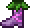 Flower Boots | 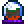 Gravity Globe |  Atomic Ninja Boots |
| 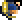 Utility Helmet |  Nanites (x20) | | 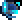 Cybernetic Utility Helmet |

### Armor
All of the items below are crafted at the  Tinkerer's Workshop.

| Ingredients  |     |     | Result |
| ------------ | --- | --- | ------ |
| 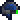 Night Vision Helmet |  Spelunker Potion (x20) | |  Caving Gear |
|  Caving Gear | 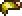 Mining Helmet | | 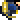 Mining Gear |
| 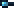 Goggles | 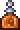 Hunter Potion (x20) | 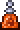 Dangersense Potion (x20) |  Orange-Tinted Goggles |
|  Orange-Tinted Goggles |  Mining Gear | |  Utility Helmet |

### Placeables
| Crafting Station | Ingredients  |     | Result |
| ---------------- | ------------ | --- | ------ |
| 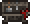 Heavy Work Bench |  Life Crystal | 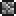 Stone Block (x50) | 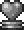 Heart Statue |
|  Heavy Work Bench | 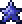 Mana Crystal |  Stone Block (x50) | 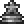 Star Statue |
|  Heavy Work Bench |   Any Gold Crown |  Stone Block (x50) |   Queen/King Statue |
|   Table and Chair |   Any Gold Bar (x15) |  Lens (x5) |  Sextant |
|  Tinkerer's Workshop |  Extractinator |  Alchemy Table |  Alteration Station |
|  Loom |       Colored Slime Banners | |  Supreme Slime Banner |
|  Loom |       Elemental Slime Banners | |  Elemental Slime Banner |
|  Loom |  Elemental Slime Banner |  Supreme Slime Banner |  Ultimate Slime Banner
|  Loom |      Goblin Army Banners | |  Goblin Army Banner |
|  Loom |      Vortex Pillar Banners | |  Vortex Pillar Banner |
|  Loom |      Stardust Pillar Banners | |  Stardust Pillar Banner |
|  Loom |     Nebula Pillar Banners | |  Nebula Pillar Banner |
|  Loom |       Solar Pillar Banners | |  Solar Pillar Banner |
|  Loom |       Pirate Crew Banners | |  Pirate Crew Banner |
|  Loom | <ul><li> Angry Bones Banner</li><li> Dark Caster Banner</li><li> Cursed Skull Banner</li></ul> | |  Dungeon Banner |
|  Loom | <ul><li> Dungeon Slime Banner</li><li>   Armored Bones Banners</li><li> Necromancer Banner</li><li> Ragged Caster Banner</li><li> Diabolist Banner</li><li> Giant Cursed Skull Banner</li></ul> |  Dungeon Banner |  Supreme Dungeon Banner |
|  Loom | <ul><li> Paladin Banner</li><li> Skeleton Commando Banner</li><li> Skeleton Sniper Banner</li><li> Tactical Skeleton Banner</li><li> Bone Lee Banner</li><li> Dungeon Spirit Banner</li></ul> |  Supreme Dungeon Banner |  Ultimate Dungeon Banner |
|  Loom | <ul><li> Zombie Banner</li><li> Raincoat Zombie Banner</li><li> Demon Eye Banner</li></ul> | |  Undead Banner |
|   Table and Chair | <ul><li>  Any Gold Bar (x8)</li><li>  Any Iron Bar (x15)</li><li> Cloud (x15)</li><li> Snow Block (x15)</li></ul> | |  Weather Radio |
|  Bookcase | <ul><li> Book</li><li> Armored Cavefish</li><li> Specular Fish</li><li> Neon Tetra</li><li> Bass</li><li> Trout</li><li> Atlantic Cod</li></ul> | |  Fisherman's Pocket Guide |

## To-Do
* Biome banners
* Solar Eclipse Banner
* Martian Madness Banner
* Pumpkin Moon Banner
* Frost Moon Banner

## Credits
* [INFINITE POWER](https://forums.terraria.org/index.php?members/infinite-power.30898/) for the original QOL and sprites
* [Ardosos](https://forums.terraria.org/index.php?members/ardosos.50173/) for the code for the Alteration Station
* [PyroSalamander](https://forums.terraria.org/index.php?members/pyrosalamander.85695/) for suggesting the Cybernetic Utility Helmet
* Re-Logic for the item sprites