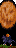

# Quality of Life: Recipes
Quality of Life: Recipes intends to recreate, add to, and improve the recipes introduced by Quality of Life.

See the [wiki](https://github.com/abluescarab/tModLoader-QualityOfLifeRecipes/wiki) to view the changes.

### Placeables
| Crafting Station | Ingredients  |     | Result |
| ---------------- | ------------ | --- | ------ |
| Loom | Colored Slime Banners | |  Supreme Slime Banner |
| Loom | Elemental Slime Banners | |  Elemental Slime Banner |
| Loom |  Elemental Slime Banner |  Supreme Slime Banner |  Ultimate Slime Banner
| Loom | Goblin Army Banners | |  Goblin Army Banner |
| Loom | Vortex Pillar Banners | |  Vortex Pillar Banner |
| Loom | Stardust Pillar Banners | |  Stardust Pillar Banner |
| Loom | Nebula Pillar Banners | |  Nebula Pillar Banner |
| Loom | Solar Pillar Banners | |  Solar Pillar Banner |
| Loom | Pirate Crew Banners | |  Pirate Crew Banner |
| Loom | <ul><li>Angry Bones Banner</li><li>Dark Caster Banner</li><li>Cursed Skull Banner</li></ul> | |  Dungeon Banner |
| Loom | <ul><li>Dungeon Slime Banner</li><li>Armored Bones Banners</li><li>Necromancer Banner</li><li>Ragged Caster Banner</li><li>Diabolist Banner</li><li>Giant Cursed Skull Banner</li></ul> |  Dungeon Banner |  Supreme Dungeon Banner |
| Loom | <ul><li>Paladin Banner</li><li>Skeleton Commando Banner</li><li>Skeleton Sniper Banner</li><li>Tactical Skeleton Banner</li><li>Bone Lee Banner</li><li>Dungeon Spirit Banner</li></ul> |  Supreme Dungeon Banner |  Ultimate Dungeon Banner |
| Loom | <ul><li>Zombie Banner</li><li>Raincoat Zombie Banner</li><li>Demon Eye Banner</li></ul> | |  Undead Banner |
| Loom | <ul><li>Present Mimic Banner</li><li>Flocko Banner</li><li>Gingerbread Man Banner</li><li>Zombie Elf Banner</li><li>Elf Archer Banner</li><li>Nutcracker Banner</li><li>Yeti Banner</li><li>Elf Copter Banner</li><li>Krampus Banner</li></ul> | |  Frost Moon Banner |
| Loom | <ul><li>Scutlix Banner</li><li>Tesla Turret Banner</li><li>Gigazapper Banner</li><li>Ray Gunner Banner</li><li>Gray Grunt Banner</li><li>Brain Scrambler Banner</li><li>Martian Walker Banner</li><li>Martian Drone Banner</li><li>Martian Engineer Banner</li><li>Martian Officer Banner</li></ul> | |  Martian Madness Banner |
| Loom | <ul><li>Scarecrow Banner</li><li>Splinterling Banner</li><li>Hellhound Banner</li><li>Poltergeist Banner</li><li>Headless Horseman Banner</li></ul> | |  Pumpkin Moon Banner |
| Loom | <ul><li>Frankenstein Banner</li><li>Swamp Thing Banner</li><li>Vampire Banner</li><li>Creature from the Deep Banner</li><li>Fritz Banner</li><li>The Possessed Banner</li></ul> | |  Solar Eclipse Banner |
| Loom | <ul><li>Eyezor Banner</li><li>Reaper Banner</li><li>Butcher Banner</li><li>Deadly Sphere Banner</li><li>Dr. Man Fly Banner</li><li>Nailhead Banner</li><li>Psycho Banner</li></ul> |  Solar Eclipse Banner |  Supreme Solar Eclipse Banner |
| Loom | Mothron Banner |  Supreme Solar Eclipse Banner |  Ultimate Solar Eclipse Banner |

## To-Do
* Biome banners
* ~~Solar Eclipse Banner~~
* ~~Martian Madness Banner~~
* ~~Pumpkin Moon Banner~~
* ~~Frost Moon Banner~~

## Credits
* [Freedbot](https://forums.terraria.org/index.php?members/freedbot.57288/) for Solar Eclipse, Frost Moon, Pumpkin Moon, Martian Madness event banner sprites
* [INFINITE POWER](https://forums.terraria.org/index.php?members/infinite-power.30898/) for the original QOL and sprites
* [Ardosos](https://forums.terraria.org/index.php?members/ardosos.50173/) for the code for the Alteration Station
* [PyroSalamander](https://forums.terraria.org/index.php?members/pyrosalamander.85695/) for suggesting the Cybernetic Mining Multi-Tool
* Re-Logic for the item sprites
